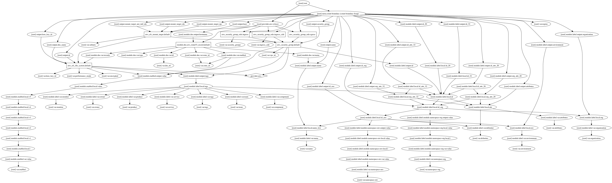

# terraform-aws-efs

[](https://circleci.com/gh/devops-workflow/terraform-aws-efs)
[](https://github.com/devops-workflow/terraform-aws-efs/releases)

Terraform module to provision an AWS [`EFS`](https://aws.amazon.com/efs/)
Network File System.

## README needs to be updated. Does not currently match module

## Usage

Include this repository as a module in your existing terraform code:

```hcl
module "efs" {
  source        = "devops-workflow/efs/aws"
  version       = "0.4.0"
  name          = "app"
  attributes    = "efs"

  region            = "${var.aws_region}"
  vpc_id            = "${var.vpc_id}"
  subnets           = "${var.private_subnets}"
  security_groups   = ["${var.security_group_id}"]

  zone_id = "${var.aws_route53_dns_zone_id}"
}
```

## Input

|  Name              |    Default     |                          Description                             |
|:-------------------|:--------------:|:-----------------------------------------------------------------|
| namespace          | `global`       | Namespace (_e.g._ `cp` or `cloudposse`)                          |
| stage              | `default`      | Stage (_e.g._ `prod`, `dev`, `staging`)                          |
| name               | `app`          | Name (_e.g._ `app` or `wordpress`)                               |
| security_groups    | `[]`           | AWS security group IDs to allow to connect to the EFS            |
| aws_region         | __REQUIRED__   | AWS region ID                                                    |
| vpc_id             | __REQUIRED__   | AWS VPC ID                                                       |
| subnets            | __REQUIRED__   | AWS subnet IDs                                                   |
| availability_zones | __REQUIRED__   | Availability Zone IDs                                            |
| zone_id            | __REQUIRED__   | Route53 dns zone ID                                              |
| attributes         | `[]`           | Additional attributes (e.g. `policy` or `role`)                  |
| tags               | `{}`           | Additional tags  (e.g. `map("BusinessUnit","XYZ")`               |
| delimiter          | `-`            | Delimiter to be used between `name`, `namespace`, `stage`, etc.  |

## Output

| Name             |        Description                                               |
|:-----------------|:-----------------------------------------------------------------|
| id               | EFS id                                                           |
| host             | Assigned DNS-record for the EFS                                  |
| security_group   | The generated EFS security group                                 |
| mount_target_ids | List of IDs of the EFS mount targets (one per Availability Zone) |
| mount_target_ips | List of IPs of the EFS mount targets (one per Availability Zone) |

<!-- BEGINNING OF PRE-COMMIT-TERRAFORM DOCS HOOK -->

<!-- END OF PRE-COMMIT-TERRAFORM DOCS HOOK -->

<!-- BEGINNING OF PRE-COMMIT-TERRAFORM GRAPH HOOK -->

### Resource Graph of plan


<!-- END OF PRE-COMMIT-TERRAFORM GRAPH HOOK -->
